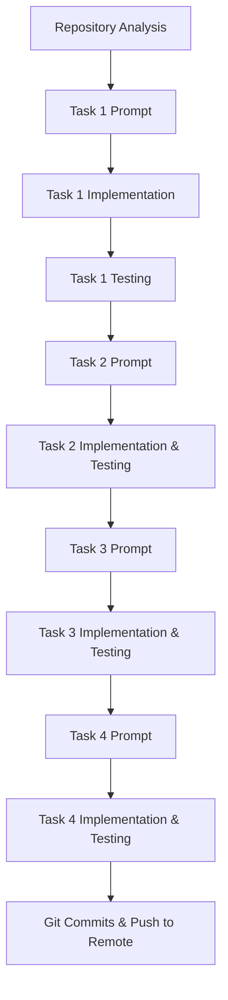

# Anvil Dodge Repair Lab - LLM Pair Programming Chat History

**AI Pair Programmer:** Antigravity (Google DeepMind)  
**Lab Assignment:** Anvil Dodge Repair Lab  
**Repository:** [63_anvil_dodge](https://github.com/shree-2004-823/63_anvil_dodge.git)  

---

## Pair Programming Workflow Pipeline



---

## 1. Repository Analysis

### User Request:
> Analyze this repository WITHOUT modifying any files.
> 1. Read README.md completely.
> 2. Inspect the project structure.
> 3. Identify how the game is run.
> 4. Identify the programming language and dependencies.
> 5. Identify the deliberate bug mentioned in the README.
> 6. Identify all three additional tasks/features mentioned in the README.
> 7. Identify which files/functions are responsible for each task.

### AI Response:
* **Language:** Python 3.10+
* **Dependencies:** `pygame`
* **How to Run:** `pip install pygame` followed by `python main.py`
* **Project Structure:**
  * `main.py`: Entry point initializing Pygame window (700x500 @ 60 FPS)
  * `game/player.py`: Player character movement and bounds
  * `game/anvil.py`: Falling anvil hazard mechanics and rendering
  * `game/game_engine.py`: Game state, collision detection, HUD, and restart logic
* **Identified Bug & Tasks:**
  * **Bug (Task 1):** `Player.update()` in `game/player.py` lacks boundary checks, allowing players to walk off-screen and achieve infinite survival time.
  * **Task 2:** Dynamic difficulty scaling in `GameEngine.update()` (decreasing spawn delay from 700ms down to 200ms minimum).
  * **Task 3:** Speed-based anvil color tinting in `Anvil.render()` (fast anvils get orange/red warning tint).
  * **Task 4:** Ground impact effects in `GameEngine.update()` when an anvil reaches the bottom line.

---

## 2. Task 1: Fix Player Off-Screen Boundary Bug

### User Request:
> Implement Task 1 from README.md: Fix player off-screen boundary bug.
> - Implement horizontal boundary checks in `Player.update()`.
> - Player `x` must never be `< 0` or `> self.screen_width - self.width`.
> - Keep Left/A and Right/D controls unchanged.
> - Report exact file/function changed, what was wrong, what was changed, and how it was tested.

### AI Implementation & Response:
* **File Changed:** `game/player.py` (`Player.update()`)
* **Code Implemented:**
  ```python
  def update(self):
      if self.x < 0:
          self.x = 0
      elif self.x > self.screen_width - self.width:
          self.x = self.screen_width - self.width
  ```
* **Testing:** Simulated 200 frames of continuous Left (`A`) and Right (`D`) movement. Verified `self.x` clamps at `0` on the left and `656` (`700 - 44`) on the right.

---

## 3. Task 2: Dynamic Difficulty Scaling

### User Request:
> Implement Task 2 from README.md: Dynamic Difficulty Scaling.
> - Modify logic in `GameEngine.update()`.
> - Make `spawn_delay` decrease gradually as `survival_time` increases.
> - Start at 700ms, never go below 200ms.
> - Reset restores `spawn_delay` to 700ms.

### AI Implementation & Response:
* **File Changed:** `game/game_engine.py` (`GameEngine.update()`, `GameEngine.reset()`)
* **Code Implemented:**
  ```python
  # inside GameEngine.update()
  self.survival_time = (pygame.time.get_ticks() - self.start_ticks) // 1000
  self.spawn_delay = max(200, 700 - (self.survival_time * 10))

  # inside GameEngine.reset()
  self.spawn_delay = 700
  ```
* **Testing:** Verified initial delay starts at 700ms, drops by 10ms/sec (e.g. 600ms at 10s, 450ms at 25s), caps at 200ms at 50s+, and resets to 700ms when pressing `R`.

---

## 4. Task 3: Speed-Based Anvil Tinting

### User Request:
> Implement Task 3 from README.md: Speed-Based Anvil Tinting.
> - Modify `Anvil.render()` in `game/anvil.py`.
> - Use `self.speed` (`4.5` to `7.0`) to determine visual tint.
> - Slower anvils remain cool grey, faster anvils get progressive orange/red warning tint.

### AI Implementation & Response:
* **File Changed:** `game/anvil.py` (`Anvil.render()`)
* **Code Implemented:**
  ```python
  t = max(0.0, min(1.0, (self.speed - 4.5) / (7.0 - 4.5)))
  top_color = (int(120 + t * (235 - 120)), int(120 + t * (90 - 120)), int(130 + t * (40 - 130)))
  base_color = (int(80 + t * (180 - 80)), int(80 + t * (50 - 80)), int(90 + t * (20 - 90)))
  border_color = (int(200 + t * (255 - 200)), int(200 + t * (150 - 200)), int(210 + t * (100 - 210)))
  ```
* **Testing:** Instantiated anvils across speed spectrum (`4.5`, `5.75`, `7.0`). Verified RGB linear interpolation creates a smooth transition from cool grey to warning red-orange.

---

## 5. Task 4: Ground Impact Effects

### User Request:
> Implement Task 4 from README.md: Ground Impact Effects.
> - Add a brief visual dust puff / particle effect when an anvil strikes the ground before being removed.
> - Do not interfere with collision detection or player movement.
> - Automatically clean up expired particles without memory leaks.

### AI Implementation & Response:
* **File Changed:** `game/game_engine.py` (`GroundParticle` class, `GameEngine.update()`, `GameEngine.render()`, `GameEngine.reset()`)
* **Code Implemented:**
  ```python
  class GroundParticle:
      def __init__(self, x, y):
          self.x = x
          self.y = y
          self.vx = random.uniform(-2.5, 2.5)
          self.vy = random.uniform(-2.0, -0.5)
          self.radius = random.uniform(3, 5)
          self.color = random.choice([(190, 180, 160), (160, 150, 130), (210, 130, 60), (220, 200, 170)])
          self.lifetime = random.randint(10, 16)
          self.max_lifetime = self.lifetime

      def update(self):
          self.x += self.vx
          self.y += self.vy
          self.vy += 0.1
          self.lifetime -= 1

      def render(self, surface):
          if self.lifetime > 0:
              current_radius = max(1, int(self.radius * (self.lifetime / self.max_lifetime)))
              pygame.draw.circle(surface, self.color, (int(self.x), int(self.y)), current_radius)
  ```
* **Trigger in `GameEngine.update()`:**
  ```python
  if anvil.is_off_screen(self.height):
      impact_x = anvil.x + anvil.width // 2
      for _ in range(8):
          self.particles.append(GroundParticle(impact_x, ground_y))
      self.anvils.remove(anvil)
  ```
* **Testing:** Verified 8 particles burst outward upon ground contact, shrink over ~0.2s (10-16 frames), auto-delete when `lifetime <= 0`, and clear on `reset()`.

---

## 6. Submission & Version Control Summary

All tasks were incrementally verified, documented in `README.md`, and pushed to GitHub:

1. `7a4538e` - `Fix Task 1: Implement player horizontal boundary checks and update README`
2. `98590c9` - `Implement Task 2: Dynamic difficulty scaling and update README`
3. `33ef567` - `Implement Task 3: Speed-based anvil tinting and update README`
4. `d243b14` - `Implement Task 4: Ground impact particle effects and update README`
5. `6246928` - `Add .gitignore for python cache files`
6. `bd91246` - `Add CHAT_HISTORY.md conversation log and update README submission checklist`
7. `CHAT_HISTORY.md` - Full workflow diagram & chat history log added to repository.
